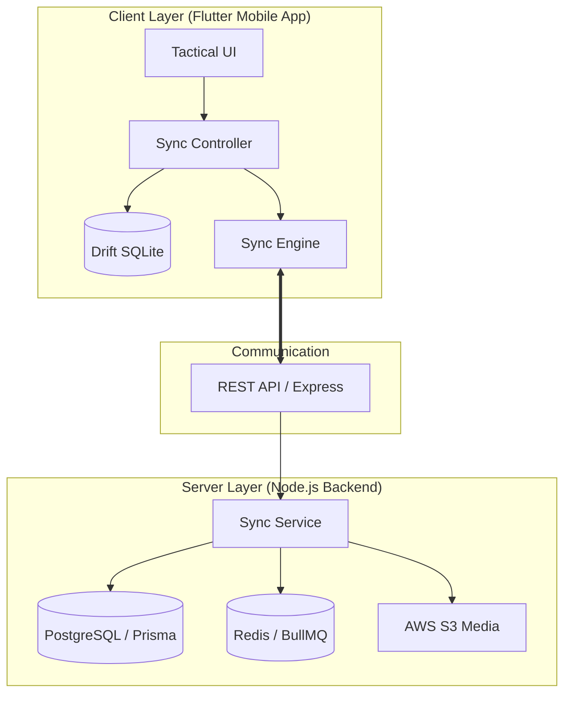

# InspectSync: Precision Field Operations Platform

[](https://github.com/shouryasonu/inspectSync)
[](./inspectsync)
[](./inspect-backend)
[](LICENSE)

**InspectSync** is a robust, enterprise-grade field inspection platform designed for high-stakes environments where data integrity and offline reliability are non-negotiable. It solves the critical "Field Data Gap" by enabling seamless operations in zero-connectivity zones through an advanced, version-controlled synchronization engine.

---

## 🏗️ System Architecture

InspectSync is built on a modern, distributed architecture designed for low latency and high reliability.



---

## Features

### 1. Optimistic Offline Engine
Engineers can perform full inspections without an internet connection. All changes are logged to an internal **Sync Queue** (Idempotent) and automatically synchronized when connectivity is restored.

### 2. Intelligent Conflict Resolution
The system employs a version-based concurrency model. Mismatches between local and server records are detected during the "Push" phase, allowing users to perform side-by-side resolution to ensure no data is lost.

### 3. Tactical "Obsidian Command" Design
The UI is optimized for field visibility, featuring high-contrast dark modes, large touch targets (min 48dp), and a "no-distraction" layout philosophy.

---

## 🛠️ Technology Stack

| Component | Technology | Why? |
|-----------|------------|------|
| **Frontend** | Flutter (Dart) | Multi-platform consistency & high-performance UI. |
| **Local Storage** | Drift (SQLite) | Reactive, type-safe local persistence. |
| **Backend** | Node.js (Express 5) | Scalable, event-driven API architecture. |
| **ORM** | Prisma | Type-safe database operations and automated migrations. |
| **Database** | PostgreSQL | Relational integrity for complex inspection models. |
| **Task Queue** | BullMQ + Redis | Robust background processing for batch sync logs. |
| **Media** | AWS S3 | Secure, scalable storage for private inspection evidence. |

---

## 🚀 Quick Start

### Prerequisites
- Flutter SDK (3.22+)
- Node.js (v20+)
- PostgreSQL & Redis (Running locally or via Docker)

### Setup

1. **Clone the repository**:
   ```bash
   git clone https://github.com/shouryasonu/inspectSync.git
   cd inspectSync
   ```

2. **Backend Setup**:
   ```bash
   cd inspect-backend
   npm install
   # Configure .env (see .env.example)
   npx prisma db push
   npm run dev
   ```

3. **Frontend Setup**:
   ```bash
   cd ../inspectsync
   flutter pub get
   flutter run
   ```

---

## 📂 Project Structure

- **[`/inspectsync`](./inspectsync)**: The Flutter mobile application.
- **[`/inspect-backend`](./inspect-backend)**: The Node.js REST API.

---

## 🛡️ Operational Resilience
- **Idempotent Sync**: Every local change has a unique `idempotencyKey` to prevent duplicate processing.
- **Delta Pulls**: The client only pulls records changed since the `last_synced_at` timestamp, minimizing bandwidth usage.
- **Presigned Security**: Media is never public; the system uses 24h AWS Presigned URLs for secure temporary access.

---

Designed with ❤️ for Field Engineers by **[Shourya Sonu](https://github.com/shonu72)**

---

## 📜 License
This project is licensed under the **MIT License**. See the [LICENSE](LICENSE) file for details.
